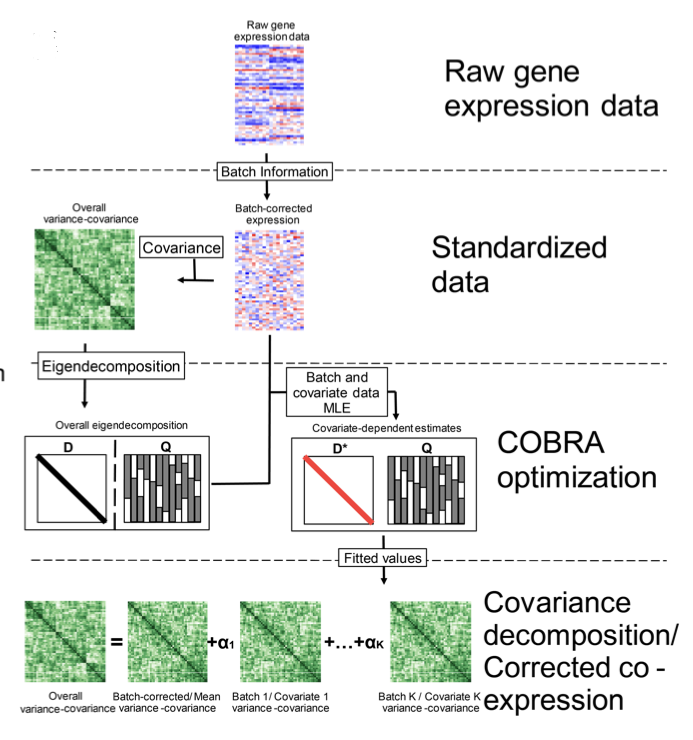

# COBRA: Higher-order batch correction to preserve network correlation

Given a gene (co-)expression matrix and a design matrix, COBRA returns a decomposition of the covariance as a linear combination of components, one for each variable in the design matrix. 

COBRA can be used for multiple tasks in computational biology, including batch correction in the covariance space, differential co-expression analysis, and understanding the impact of variables of interest - such as confounders - on the observed co-expression. In particular, it is an effective pre-processing step for gene regulatory networks inference and various studies. 





## Usage

In ```netbooks``` we provide a simple tutorial to show how to use COBRA in different applications. Check-out the [R Version](https://github.com/netZoo/netbooks/blob/main/netbooks/netZooR/COBRA.ipynb) and [Python Version](https://github.com/netZoo/netbooks/blob/main/netbooks/netZooPy/cobra.ipynb). For an interactive playground [click here](http://netbooks.networkmedicine.org/hub/login)!

COBRA is part of the [Network Zoo](https://netzoo.github.io/), and the source code is available both in and [netZooR](https://github.com/netZoo/netZooR) and [netZooPy](https://github.com/netZoo/netZooPy).

## Structure of the repo

- ```./data``` contains the data used and generated in the experiments. Note that the version on GitHub does **not** contain all the data. Please download them from [Zenodo](https://zenodo.org/record/7852640#.ZEKfV5FBxkg). 
- ```experiments``` contains the source code to reproduce our experiments.
- ```figures``` are the output figures from the experiments.

## Appreciation
- Marieke Kuijjer for the assistance in the ENCODE data pipeline. 
- Rebekka Burkholz, Chen Chen, Derrick DeConti, Dawn DeMeo, Viola Fanfani, Jonas Fischer, Intekhab Hossain, Camila Lopes-Ramos, Panagiotis Mandros, John Quackenbush, Enakshi Saha, and Katherine Shutta for thoughtful critiques and discussions.

## Citation
If you find COBRA useful, star this repository and cite us
